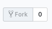

# Cash 💸 💸 💸

**Table of Contents**

- [🌼 Introduction](#-introduction)
- [📖 Modules/Libraries utilisées](#-Modules/Libraries-utilisées)
- [💻 Installation](#Installation)
- [👀 What you can do](#what-you-can-do)
- [🔏Licence](#licence)

## Introduction 🌼

The cash program allows you to know the convert change of any currency to another by using the following API : https://api.exchangeratesapi.io/latest.

## Modules/Libraries used 📖

This program is using multiple modules and libraries as : got, money, chalk, ora, conf, meow and chalk.

## Installation 💻

In order to install and use the cash program you need to :

<ol>
<li>Fork the project via GitHub



</li>

<li>Clone your forked repository project https://github.com/YOUR_USERNAME/cash

```sh
❯ cd /path/to/workspace
❯ git clone git@github.com:YOUR_USERNAME/cash.git
```

</li>

Then you can start using your program by doing :

```sh
❯ cd /path/to/workspace/cash
❯ npm i
❯ node bin/index.js
```

By default, you, now, have the exchange rate of a dollar to 'EUR', 'GBP', 'JPY', 'CAD'.

## What you can do 👀

This program can convert any amount of a certain currency to another. To do so, you only have to complete the following commands in your Console/Terminal.

#####Usage
cash "amount" "from" "to"
cash "options"
#####Options
--set -s : Set default currencies
#####Examples
cash eur (To get the convert change of 1 EUR)
cash 10 usd eur pln
cash --set usd aud

## Licence 🔏

_[Uncopyrighted]_
